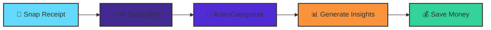

<div align="center">


<h1>
  
  Receipt-to-Spending Tracker
  
</h1>

<p align="center">
  <em>Transform Paper Receipts into Actionable Financial Insights with AI</em>
</p>


<p align="center">
  
  
  
  
  
</p>


<p align="center">
  
  
  
  
</p>

<p align="center">
  <a href="#-features">Features</a> •
  <a href="#-tech-stack">Tech Stack</a> •
  <a href="#-getting-started">Getting Started</a> •
  <a href="#-architecture">Architecture</a> •
  <a href="#-team">Team</a>
</p>

</div>

---

## 🎯 Project Overview

> **Senior Capstone Project** | Computer Science | 2025

Receipt-to-Spending Tracker is a **full-stack mobile application** that eliminates manual expense tracking by leveraging **AI-powered receipt scanning** and providing **intelligent spending insights**. Built from the ground up using modern technologies and industry best practices.

### 🌟 Key Innovation

**Problem:** Manual expense tracking is tedious and error-prone  
**Solution:** AI extracts structured data from receipt photos in seconds  
**Result:** Effortless financial management with actionable insights

<div align="center">



</div>

---

## ✨ Features

<table>
<tr>
<td width="50%">

### 🔐 Secure Authentication
- JWT-based session management
- Encrypted password storage
- Personalized user profiles
- Weekly budget limits

</td>
<td width="50%">

### 📸 Smart Receipt Scanning
- AI-powered OCR with GPT-4 Vision
- Automatic data extraction
- Manual correction capability
- Item-level categorization

</td>
</tr>
<tr>
<td width="50%">

### 📊 Spending Analytics
- Real-time category breakdown
- Weekly trend visualization
- Budget vs. actual comparison
- AI-generated money tips

</td>
<td width="50%">

### 💾 Receipt Management
- Full CRUD operations
- Advanced search & filters
- Date-based sorting
- Category-based organization

</td>
</tr>
</table>

---

## 🏗️ Architecture

<div align="center">

### System Design

```
┏━━━━━━━━━━━━━━━━━━━━━━━━━━━━━━━━━━━━━━━━┓
┃        📱 Mobile App Layer             ┃
┃    (Expo React Native + TypeScript)   ┃
┣━━━━━━━━━━━━━━━━━━━━━━━━━━━━━━━━━━━━━━━━┫
┃  Camera  │  Dashboard  │  Receipt List ┃
┗━━━━━━━━━┳━━━━━━━━━━━━━┳━━━━━━━━━━━━━━━┛
          │             │
          │   HTTPS     │
          │   REST      │
          ↓             ↓
┏━━━━━━━━━━━━━━━━━━━━━━━━━━━━━━━━━━━━━━━━┓
┃       🖥️  Backend API Layer            ┃
┃     (ASP.NET Core 8.0 + C#)           ┃
┣━━━━━━━━━━━━━━━━━━━━━━━━━━━━━━━━━━━━━━━━┫
┃  Controllers → Services → Repositories ┃
┗━━━┳━━━━━━━━━━━━━┳━━━━━━━━━━━━━━━━━┳━━━┛
    │             │                 │
    ↓             ↓                 ↓
┌─────────┐  ┌──────────┐   ┌────────────┐
│ SQLite  │  │ OpenAI   │   │   JWT      │
│ Database│  │ Vision   │   │   Auth     │
└─────────┘  └──────────┘   └────────────┘
```

</div>

<details>
<summary><b>🗄️ Database Schema (Click to Expand)</b></summary>

```sql
┌─────────────────────────────┐
│          👤 User            │
├─────────────────────────────┤
│ • UserId (PK)               │
│ • Name                      │
│ • Email                     │
│ • Password (Hashed)         │
│ • WeeklyLimit               │
└──────────┬──────────────────┘
           │ 1:N
           ↓
┌─────────────────────────────┐
│        🧾 Receipt           │
├─────────────────────────────┤
│ • ReceiptId (PK)            │
│ • UserId (FK) ────────────┐ │
│ • Store                   │ │
│ • Amount (Calculated)     │ │
│ • Date                    │ │
└──────────┬────────────────┘ │
           │ 1:N              │
           ↓                  │
┌─────────────────────────────┐
│      📋 ReceiptItem         │
├─────────────────────────────┤
│ • ItemId (PK)               │
│ • ReceiptId (FK) ─────────┘ │
│ • ItemName                  │
│ • Price                     │
│ • Quantity                  │
│ • Category (Auto/Manual)    │
└─────────────────────────────┘
```

</details>

---

## 🔌 API Reference

<div align="center">

### RESTful Endpoints

</div>

<table>
<thead>
<tr>
<th width="15%">Method</th>
<th width="40%">Endpoint</th>
<th width="45%">Description</th>
</tr>
</thead>
<tbody>

<!-- Authentication -->
<tr>
<td colspan="3" align="center"><b>🔐 Authentication</b></td>
</tr>
<tr>
<td><code>POST</code></td>
<td><code>/api/auth/register</code></td>
<td>Create new user account → Returns JWT</td>
</tr>
<tr>
<td><code>POST</code></td>
<td><code>/api/auth/login</code></td>
<td>Authenticate user → Returns JWT token</td>
</tr>

<!-- Receipts -->
<tr>
<td colspan="3" align="center"><b>🧾 Receipt Management</b></td>
</tr>
<tr>
<td><code>GET</code></td>
<td><code>/api/receipt</code></td>
<td>Fetch all user receipts (with filters)</td>
</tr>
<tr>
<td><code>GET</code></td>
<td><code>/api/receipt/{id}</code></td>
<td>Fetch single receipt with items</td>
</tr>
<tr>
<td><code>POST</code></td>
<td><code>/api/receipt</code></td>
<td>Create receipt (AI scan or manual entry)</td>
</tr>
<tr>
<td><code>DELETE</code></td>
<td><code>/api/receipt/{id}</code></td>
<td>Delete receipt and cascade items</td>
</tr>

<!-- Items -->
<tr>
<td colspan="3" align="center"><b>📋 Item Operations</b></td>
</tr>
<tr>
<td><code>POST</code></td>
<td><code>/api/receipt/items/add</code></td>
<td>Add missed item to receipt</td>
</tr>
<tr>
<td><code>PUT</code></td>
<td><code>/api/receipt/items</code></td>
<td>Update item details (name/price/qty)</td>
</tr>
<tr>
<td><code>DELETE</code></td>
<td><code>/api/receipt/items/{id}</code></td>
<td>Remove item from receipt</td>
</tr>

<!-- Analytics -->
<tr>
<td colspan="3" align="center"><b>📊 Analytics & Insights</b></td>
</tr>
<tr>
<td><code>GET</code></td>
<td><code>/api/insights/summary</code></td>
<td>Get spending breakdown + AI tips</td>
</tr>

</tbody>
</table>

---

## 🛠️ Tech Stack

<div align="center">

### Frontend Technologies


<table>
<tr>
<td align="center" width="20%"><b>Expo</b><br/>React Native Framework</td>
<td align="center" width="20%"><b>JavaScript</b><br/>Primary Language</td>
<td align="center" width="20%"><b>React Navigation</b><br/>Screen Routing</td>
<td align="center" width="20%"><b>Axios</b><br/>HTTP Client</td>
<td align="center" width="20%"><b>SecureStore</b><br/>Token Storage</td>
</tr>
</table>

### Backend Technologies


<table>
<tr>
<td align="center" width="20%"><b>ASP.NET Core</b><br/>Web Framework</td>
<td align="center" width="20%"><b>C# 12</b><br/>Primary Language</td>
<td align="center" width="20%"><b>Entity Framework</b><br/>ORM Tool</td>
<td align="center" width="20%"><b>SQLite</b><br/>Database</td>
<td align="center" width="20%"><b>Swagger</b><br/>API Docs</td>
</tr>
</table>

### AI & Tools


<table>
<tr>
<td align="center" width="25%"><b>OpenAI GPT-4 Vision</b><br/>Receipt OCR</td>
<td align="center" width="25%"><b>OpenAI GPT-4</b><br/>Insights Generation</td>
<td align="center" width="25%"><b>Git/GitHub</b><br/>Version Control</td>
<td align="center" width="25%"><b>Agile/Scrum</b><br/>Methodology</td>
</tr>
</table>

</div>

---

## 🚀 Getting Started

<details>
<summary><b>📋 Prerequisites</b></summary>

```bash
# Required Software
✓ .NET 8.0 SDK
✓ Node.js 18+
✓ Expo CLI
✓ OpenAI API Key
✓ Git
```

</details>

### ⚡ Quick Start

<table>
<tr>
<td width="50%" valign="top">

#### 🖥️ Backend Setup

```bash
# 1. Clone repository
git clone https://github.com/UcheOnwe/Receipts-To-Spending-Tracker.git
cd Receipts-To-Spending-Tracker/backend-api/API

# 2. Install dependencies
dotnet restore

# 3. Update appsettings.json
# Add your OpenAI API key

# 4. Create database
dotnet ef database update

# 5. Run API
dotnet run
```

✅ **API Running:** `https://localhost:7xxx`  
📚 **Swagger Docs:** `https://localhost:7xxx/swagger`

</td>
<td width="50%" valign="top">

#### 📱 Frontend Setup

```bash
# 1. Navigate to mobile app
cd ../mobile-app

# 2. Install dependencies
npm install

# 3. Update API URL
# Edit src/services/api.js

# 4. Start Expo
npx expo start

# 5. Run on device
# Scan QR with Expo Go app
# or press 'a' for Android / 'i' for iOS
```

✅ **App Running:** Scan QR Code  
📱 **Expo Dashboard:** `http://localhost:19000`

</td>
</tr>
</table>

---

## 👥 Team

<div align="center">

### 🌟 Meet the Developers

<table>
<tr>
<td align="center" width="20%">

<br />
<b>Uche Onwe</b>
<br />
<sub>Backend Lead</sub>
<br />
<sub>Database Architecture</sub>
<br />
<a href="https://github.com/UcheOnwe">

</a>
</td>
<td align="center" width="20%">

<br />
<b>Carlos</b>
<br />
<sub>Frontend Developer</sub>
<br />
<sub>Mobile UI/UX</sub>
<br />
<a href="https://github.com/carlos">

</a>
</td>
<td align="center" width="20%">

<br />
<b>Jon</b>
<br />
<sub>Frontend Developer</sub>
<br />
<sub>Data Visualization</sub>
<br />
<a href="https://github.com/jon">

</a>
</td>
<td align="center" width="20%">

<br />
<b>Courtney</b>
<br />
<sub>Full-Stack Developer</sub>
<br />
<sub>Authentication System</sub>
<br />
<a href="https://github.com/courtney">

</a>
</td>
<td align="center" width="20%">

<br />
<b>Jake</b>
<br />
<sub>QA & DevOps</sub>
<br />
<sub>Testing & Documentation</sub>
<br />
<a href="https://github.com/jake">

</a>
</td>
</tr>
</table>

### 🤝 Contributions

| Team Member | Key Contributions |
|-------------|-------------------|
| **Uche** | REST API design • Entity Framework setup • OpenAI integration • Database schema |
| **Carlos** | Camera integration • Receipt scanning UI • Mobile navigation • Image handling |
| **Jon** | Analytics dashboard • Chart visualizations • State management • React hooks |
| **Courtney** | JWT authentication • API-mobile integration • SecureStore • User flows |
| **Jake** | QA automation • Bug tracking • Swagger testing • README documentation |

</div>

---

## 📊 Project Highlights

<div align="center">

<table>
<tr>
<td align="center" width="25%">

<br />
<b>8 Weeks</b>
<br />
<sub>Development Time</sub>
</td>
<td align="center" width="25%">

<br />
<b>2,500+ Lines</b>
<br />
<sub>Total Code</sub>
</td>
<td align="center" width="25%">

<br />
<b>3 Tables</b>
<br />
<sub>Relational Database</sub>
</td>
<td align="center" width="25%">

<br />
<b>11 Endpoints</b>
<br />
<sub>RESTful API</sub>
</td>
</tr>
</table>

### 🎯 Methodology: Agile/Scrum

```
Sprint 1 → Authentication & User Management
Sprint 2 → Receipt Scanning & OpenAI Integration
Sprint 3 → Receipt History & CRUD Operations
Sprint 4 → Analytics Dashboard & Insights
```

</div>

---

## 🔮 Future Roadmap

<table>
<tr>
<td width="33%" valign="top">

### 🚀 Phase 2
- [ ] Cloud deployment (Azure)
- [ ] OAuth integration
- [ ] Export to PDF/CSV
- [ ] Cloud photo storage
- [ ] Push notifications

</td>
<td width="33%" valign="top">

### 💡 Phase 3
- [ ] Shared budgets
- [ ] ML categorization
- [ ] Warranty tracking
- [ ] Bank API integration
- [ ] Tax suggestions

</td>
<td width="33%" valign="top">

### 🌟 Phase 4
- [ ] Subscription plans
- [ ] Multi-currency support
- [ ] Receipt templates
- [ ] Expense reports
- [ ] Mobile web version

</td>
</tr>
</table>

---

## 📚 Documentation

<div align="center">

| Document | Description | Status |
|----------|-------------|--------|
| [API Reference](docs/API.md) | Complete endpoint documentation | ✅ |
| [Database Schema](docs/DATABASE.md) | ER diagrams and relationships | ✅ |
| [Architecture](docs/ARCHITECTURE.md) | System design and patterns | ✅ |
| [Contributing](CONTRIBUTING.md) | Team contribution guidelines | ✅ |
| [Testing Guide](docs/TESTING.md) | QA procedures and test cases | 🚧 |

</div>

---

## 📄 License & Acknowledgments

<div align="center">

**License:** This project is part of a senior capstone course. All rights reserved by the development team.

### 🙏 Special Thanks

<table>
<tr>
<td align="center" width="33%">

<br />
<b>Microsoft</b>
<br />
<sub>.NET Framework</sub>
</td>
<td align="center" width="33%">

<br />
<b>React Team</b>
<br />
<sub>React Native</sub>
</td>
<td align="center" width="33%">

<br />
<b>OpenAI</b>
<br />
<sub>GPT-4 Vision API</sub>
</td>
</tr>
</table>

</div>

---

<div align="center">

## 📬 Contact & Links

<a href="https://github.com/UcheOnwe/Receipts-To-Spending-Tracker">

</a>
<a href="https://github.com/UcheOnwe">

</a>
<a href="mailto:your.email@example.com">

</a>

---

### ⭐ Star this repo if you found it helpful!


**Built with ❤️ by Team Receipt Trackers | 2025**

</div>
